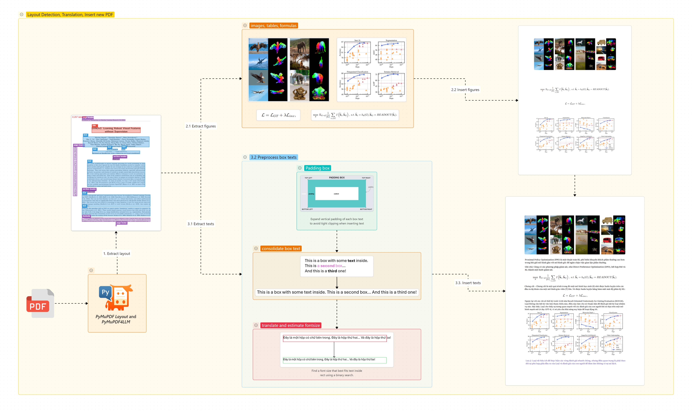
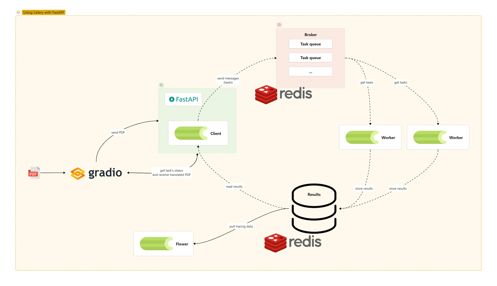

# PDF Layout Translator

**A efficient PDF translation service that preserves the original layout** – perfect for academic papers, technical reports, and any richly formatted documents.

  
*High-level pipeline: extract layout → keep images/tables/formulas → translate text → re-insert translated text with perfect fitting*

  
*Asynchronous architecture using FastAPI + Celery + Redis + Flower*

## Features

Translates PDF documents from one language to another **while preserving 95% of the original layout**:

- Images, charts, tables, formulas stay exactly in place
- Text boxes are detected, translated, and re-inserted with automatically adjusted font size 
- Supports high-quality translation via **GROQ**, **OpenAI**, or fallback Google Translate
- Batched, asynchronous processing with real-time progress tracking
- Built-in **Redis caching** of layout data – identical PDFs are processed in < 1 s after the first run
- Built for large academic/technical PDFs (10–30 pages)
- Simple Gradio UI + clean REST API

## Tech Stack Overview

| Component     | Role                                                                                 | Why we chose it                                   |
|---------------|--------------------------------------------------------------------------------------|---------------------------------------------------|
| **FastAPI**   | High-performance API layer (async, auto-docs, easy validation)                      | Speed + excellent developer experience            |
| **Celery**    | Distributed task queue – runs heavy PDF processing in background workers            | Reliable, scalable, retries, monitoring           |
| **Redis**     | Message broker for Celery, result backend **and** layout data cache                            | In-memory, extremely fast, simple                 |
| **Flower**    | Real-time web UI to monitor Celery workers, tasks, and failures                     | Great for debugging and monitoring     |
| **PyMuPDF + PyMuPDF Layout** | Layout analysis, image extraction, precise text insertion                       | Best-in-class PDF manipulation in Python          |
| **Gradio**    | Simple, beautiful frontend to upload PDFs and watch progress                        | Zero-frontend hassle, works instantly             |
| **GROQ / OpenAI** | High-quality, fast LLM translation | Superior quality for technical text |

## How It Works – Step by Step

### 1. Layout Detection & Figure Extraction
- `pymupdf4llm.to_json(...)` analyzes the PDF at 300 DPI and returns a full hierarchical layout (text boxes, images, tables, formulas, headers, etc.).
- All non-text elements (pictures, tables, formulas) are cropped and re-inserted into a clean “figure-only” PDF.

### 2. Text Pre-processing
- Each text box is cleaned (remove artifacts, normalize Unicode, collapse spaces).
- Vertical padding is added to prevent clipping when re-inserting longer translated text.

### 3. Batched Translation
- Texts are sent in batches (default 8 boxes) to GROQ/OpenAI (or fallback Google).
- Run binary search with custom font to find the perfect font size so translated text fits exactly in the original box.

### 4. Text Re-insertion
- Translated text is inserted using the font user choose and original color.
- The final PDF is a perfect overlay of translated text on top of the figure-only PDF → layout is 95% preserved.

### 5. Asynchronous Flow (Celery)
```
User → Gradio UI
        ↓ (upload + form)
     FastAPI /api/pdf/translate
        ↓ (enqueue)
       Celery task → Worker → Redis (result)
        ↓
   Gradio polls /api/task/<task_id> every 1.5s
        ↓
   SUCCESS → download translated PDF
```

Flower (`http://localhost:5555`) lets you watch every task live.

### Smart Caching (Redis)

- **Layout detection** (the most expensive step) is cached **once per unique PDF file** using its MD5 checksum.  
- The first time a PDF is uploaded → full layout analysis runs (takes several seconds).  
- Any subsequent upload of **the exact same file** (even with different target language or different font) instantly reuses the cached layout data → processing becomes **2–10× faster**.  

## Quick Start Application

```bash
# Clone repo
git clone https://github.com/yourname/pdf-layout-translator.git
cd pdf-layout-translator

# Copy env example
cp backend/.env.example backend/.env
# Edit .env and put your GROQ or OpenAI key

# Start backend
cd backend/
docker compose up --build

# Open another terminal to start gradio ui (frontend)
cd frontend/
python main.py
```

Services will be available at:

| Service         | URL                                 | Notes                                  |
|-----------------|-------------------------------------|----------------------------------------|
| API             | http://localhost:30000/api          | Swagger UI: /docs                      |
| Gradio UI       | http://localhost:7860               | Upload & real-time logs                |
| Flower (Celery) | http://localhost:5555               | Username/password set in .env          |
| Redis           | localhost:6379 (internal)           |                                        |

## Supported Languages & Fonts

Defined in `backend/app/configs/`. Easy to extend.

Current fonts: Noto Sans, Roboto, Source Serif 4, Lora, Inter, Montserrat, OpenSans, etc.  
Current languages: just Latin-based alphabet language (English, Vietnamese, French, Spanish, French, German, Italian, etc.)
